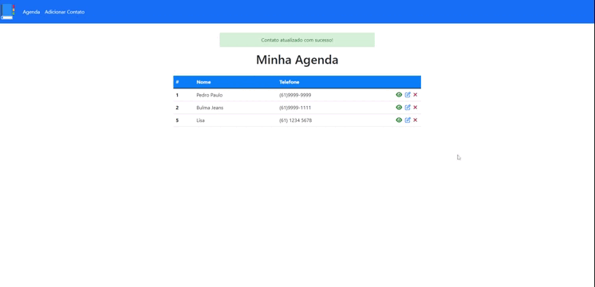

# :computer:  Projeto AgendaPHP

<h1 align="center">
	
</h1>

## Objetivo

Repositório feito para praticar PHP e banco de dados.

## Sobre

Projeto de agenda feito em PHP com banco de dados para treinar as opções de CRUD.

- [x] Adiciona contato;
- [x] Edita contato;
- [x] Deleta contato.

## Tecnologias

- PHP
- PDO
- Bootstrap
- HTML/CSS

## Como rodar o projeto

Sua estação de trabalho deve estar configurada para rodar o PHP.

1. Importe o banco de dados ´agenda´ que está na pasta BD do projeto;
2. Utilize o servidor Apache para rodar o mesmo.

Obs.: Caso o banco de dados não funcione, crie um novo bd com nome de agenda. Dentro uma tabela contacts (id, name, phone, observations).
